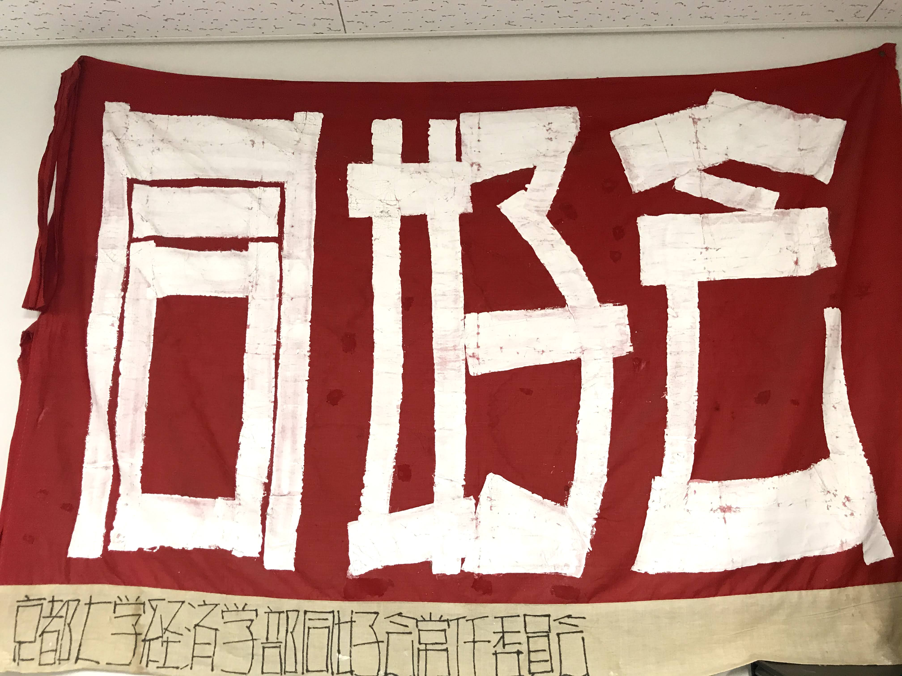

# 京都大学 経済学部同好会
#### ~Since 1919~

京都大学経済学部同好会は経済学部の自治会です。

# 学生アカウントメニュー
#### 一部の機能はログインなしでもお使いいただけます
- 学生アカウントを作成
- ログイン

> マイページ
> ログアウト

# モバイル端末へのインストール方法
#### 経済学部同好会WEBアプリはPWA(プログレッシブウェブアプリ)に対応しており、ブラウザ上でも全ての機能をお使いいただけますが、iPhone, Androidへのインストールが可能です。是非、ご利用ください。

## iPhoneへのインストール
Safariでこのページを開き、画面中央下のSafariのメニューから「ホーム画面に追加」を選ぶことで、ホーム画面に「同好会」アプリが追加されます。
## Androidへのインストール
Google Chromeでこのページを開くと「ホーム画面に同好会を追加」のポップアップが開きますので、「インストール」を押すとアプリとして追加されます。

# 機能メニュー
#### コンテンツ
- 経済学部ゼミ紹介
- 購読室利用申し込み
- 印刷室ご利用方法
- 期末試験問題

#### その他
- お問い合わせ
- アカウント設定
